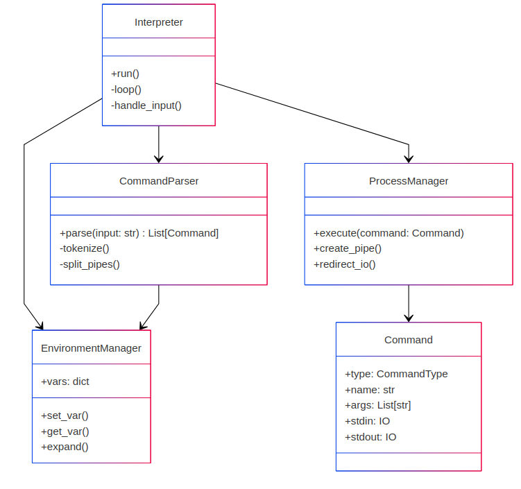

# Архитектурная документация CLI (IEEE 42010:2011)

## 1. Введение
### 1.1 Цель
Документ описывает архитектуру интерпретатора командной строки (CLI) для обеспечения прозрачности проектных решений, взаимодействия компонентов и соответствия требованиям заинтересованных сторон.

### 1.2 Область применения
- Логическая структура компонентов.
- Последовательность обработки команд.
- Взаимодействие с окружением.
- Механизмы выполнения пайплайнов и подстановки переменных.

### 1.3 Целевая аудитория
- Разработчики.
- Тестировщики.
- Системные администраторы.

---

## 2. Заинтересованные стороны и требования
| **Стейкхолдер**         | **Требования**                                                              |
|-------------------------|-----------------------------------------------------------------------------|
| Разработчики            | Модульность, расширяемость, соблюдение SOLID.                              |
| Пользователи CLI        | Поддержка пайплайнов (\|), подстановка `$VAR`, обработка кавычек.          |
| Системные администраторы | Совместимость с POSIX, управление переменными окружения.                   |

---

## 3. Архитектурные представления
### 3.1 Логическое представление
**Компоненты**:
1. **Interpreter**  
   - Управляет циклом выполнения (`run()`, `loop()`).  
   - Координирует парсер, фабрику команд и менеджер процессов.  

2. **CommandParser**  
   - Токенизация с учётом кавычек и экранирования (`tokenize()`).  
   - Разделение пайплайнов (`split_pipes()`).  

3. **EnvironmentManager**  
   - Хранит переменные (`vars: dict`).  
   - Подстановка значений (`expand()`).  

4. **CommandFactory**  
   - Создает объекты `Command` (встроенные/внешние команды).  

5. **ProcessManager**  
   - Управляет процессами (`execute()`).  
   - Организует пайплайны (`create_pipe()`).  

**Диаграмма компонентов**:  


---

### 3.2 Процессуальное представление
**Последовательность обработки команды**:
1. Пользователь вводит: `echo "Hello $USER" \| cat > output.txt`.
2. `Interpreter` передает ввод в `CommandParser`.
3. Парсер:
   - Разделяет команды по `\|`: `["echo 'Hello $USER'", "cat > output.txt"]`.
   - Токенизирует аргументы.
   - Запрашивает подстановку переменных у `EnvironmentManager`.
4. `CommandFactory` создает объекты:
   - `Command(type=BUILTIN, name="echo", args=["Hello, john"])`.
   - `Command(type=EXTERNAL, name="cat", stdout=open("output.txt", "w"))`.
5. `ProcessManager` запускает процессы и связывает их через пайпы.

**Диаграмма последовательности**:  


---

### 3.3 Физическое представление
- **Развертывание**: Исполняемый файл в POSIX-системах (Linux/macOS).
- **Зависимости**:
  - Python 3.8+.
  - Системные библиотеки: `subprocess`, `os`, `re`.

---

## 4. Ключевые архитектурные решения
### 4.1 Использование объектов `Command`
**Обоснование**:
- Инкапсуляция параметров (тип, аргументы, ввод-вывод).
- Упрощение обработки пайплайнов.

```python
class Command:
    type: CommandType  # BUILTIN/EXTERNAL
    name: str
    args: List[str]
    stdin: Optional[IO]
    stdout: Optional[IO]
```

### 4.2 Разделение парсинга и подстановки переменных
**Обоснование**:
- Подстановка выполняется после токенизации для учета контекста кавычек.
- Регулярное выражение в `EnvironmentManager`:


```python
re.sub(r'\$\{?(\w+)\}?', lambda m: self.vars.get(m.group(1), token))
```

## 5. Соответствие требованиям

### 5.1 Функциональные требования

| ID  | Требование                          | Реализация                                                                 |
|-----|-------------------------------------|----------------------------------------------------------------------------|
| FR1 | Поддержка пайплайнов команд         | Реализовано в ProcessManager через создание цепочек процессов с os.pipe()  |
| FR2 | Подстановка переменных окружения    | Обеспечивается EnvironmentManager.expand() с обработкой $VAR и ${VAR}      |
| FR3 | Обработка кавычек и экранирования   | CommandParser корректно обрабатывает двойные/одинарные кавычки и \символы  |

### 5.2 Нефункциональные требования

| ID  | Требование                          | Реализация                                                                 |
|-----|-------------------------------------|----------------------------------------------------------------------------|
| NFR1| Совместимость с POSIX               | Поддержка стандартных конструкций shell (пайпы, перенаправления)           |
| NFR2| Производительность                 | Оптимизированная обработка команд без избыточного создания процессов      |
| NFR3| Расширяемость                      | Четкое разделение компонентов позволяет добавлять новые типы команд       |

---

## 6. Глоссарий

**Пайплайн (Pipeline)**  
Механизм передачи вывода одной команды на вход другой через символ `|`. Реализуется через системные вызовы pipe().

**Токенизация (Tokenization)**  
Процесс разбиения входной строки на логические элементы (токены) с учетом:
- Пробелов-разделителей
- Кавычек (одинарных и двойных)
- Экранированных символов

**Подстановка переменных (Variable Expansion)**  
Замена конструкций вида `$VAR` и `${VAR}` на соответствующие значения из:
- Локального хранилища EnvironmentManager
- Системного окружения (os.environ)

---

## 7. История изменений

### Версия 1.1 (2023-11-15)
- Добавлена поддержка конструкций `${VAR:-default}`
- Оптимизирована обработка длинных пайплайнов
- Исправлена обработка экранированных пробелов

### Версия 1.0 (2023-10-25)
- Первоначальная версия интерпретатора
- Базовая реализация:
  - Парсинг команд
  - Подстановка переменных
  - Выполнение пайплайнов

---

## Приложения

### А. Диаграммы

1. **Схема компонентов**  
   
   
   *Рисунок 1. Компоненты*

2. **Последовательность выполнения**  
   

   *Рисунок 2. Процесс обработки команды*

### Б. Примеры использования

```bash
# Пример 1: Пайплайн с подстановкой
echo "Current user: $USER" | grep "admin"

# Пример 2: Перенаправление вывода
ls -l > file_list.txt

# Пример 3: Комбинирование команд
find . -name "*.py" | xargs wc -l | sort -nr
```

### В. Справочные материалы
1. IEEE Std 42010-2011 - Systems and software engineering — Architecture description
2. POSIX.1-2017 - Standard for Information Technology
