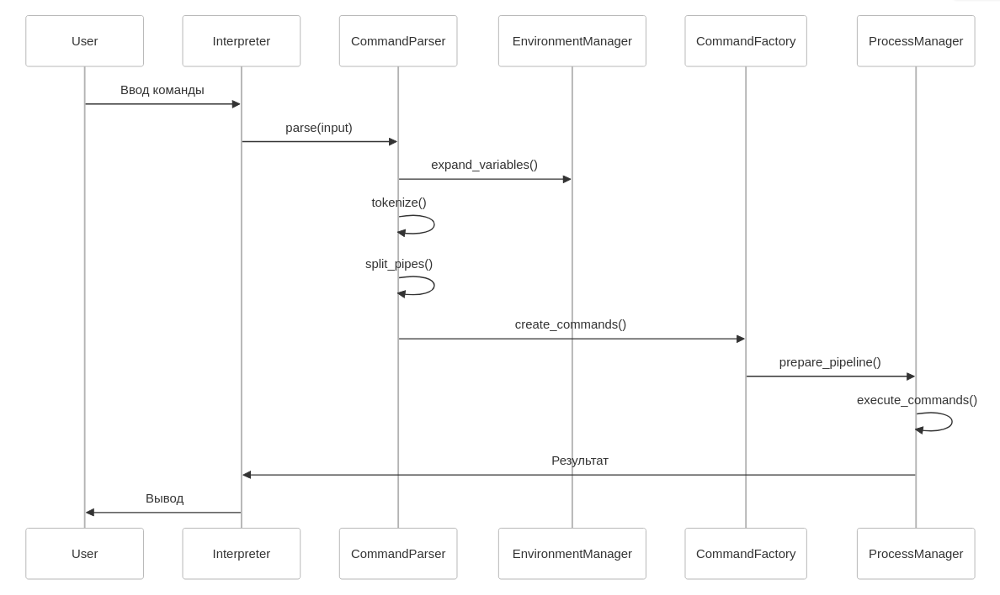
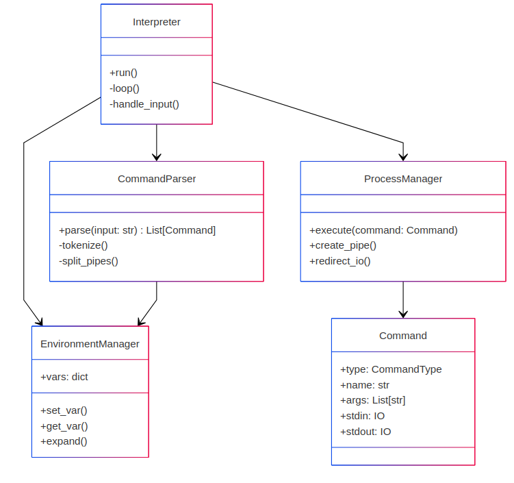

# Описание архитектуры
## Декомпозиция задачи на подсистемы, классы и методы:
### Основные компоненты
1. Интерпретатор (`Interpreter`)
  * Управляет жизненным циклом приложения
  * Координирует взаимодействие компонентов
  * Обрабатывает сигнал выхода
2. Парсер команд (`CommandParser`)
  * Обрабатывает строку ввода с учётом:
    - Кавычек (одинарных/двойных)
    - Экранирования символов
    - Подстановки переменных
  * Выделяет пайплайны и отдельные команды
3. Менеджер окружения (`EnvironmentManager`)
  * Хранит переменные в словаре
  * Обрабатывает присваивания вида `VAR=value`
  * Выполняет подстановку `$VAR`
4. Обработчик команд (`CommandHandler`)
  * Выполняет встроенные команды (`cat`, `echo` и др.)
  * Определяет тип команды (встроенная/внешняя)
5. Менеджер процессов (`ProcessManager`)
  * Управляет внешними процессами
  * Обрабатывает пайплайны
  * Контролирует потоки ввода-вывода
6. Фабрика команд (`CommandFactory`)
  * Создает объекты команд по результатам парсинга
  * Определяет тип команды и параметры выполнения
## Последовательность обработки данных

## Моменты реализации
### 1. Парсинг и токенизация
- Этапы обработки:
  1. Разделение на пайплайны по символу `|`
  2. Подстановка переменных в пределах кавычек:
     - Двойные кавычки: разрешена подстановка
     - Одинарные: подстановка запрещена
  3. Токенизация с учётом:
     - Экранированных символов (`\n`, `\t` и др.)
     - Вложенных кавычек
     - Комментариев (если требуется)
### 2. Подстановка переменных
- Реализуется после токенизации
- Обрабатывает конструкции вида `$VAR` и `${VAR}`
- Приоритеты:
  1. Локальные переменные интерпретатора
  2. Системные переменные окружения
### 3. Представление команд
Каждая команда представляется объектом:
```python
class Command:
    def __init__(self):
        self.type: CommandType  # either BUILTIN or EXTERNAL
        self.name: str
        self.args: List[str]
        self.stdin: Optional[IO]
        self.stdout: Optional[IO]
        self.pipe: Optional[Command]
    
    # ...
```
### 4. Работа с пайплайнами
- Для каждого пайплайна создается цепочка процессов
- Используются пайпы
### 5. Управление окружением
- Хранение переменных:
```python
class EnvironmentManager:
    def __init__(self):
        self.vars = {}
        self.vars.update(os.environ)
    
    def set_var(self, name, value):
        if '=' in name:
            raise ValueError("Invalid variable name")
        self.vars[name] = value
    
    def expand(self, token):
        return re.sub(r'\$(\w+)', lambda m: self.vars.get(m.group(1), ''), token)

    # ...
```

## Диаграмма компонентов

