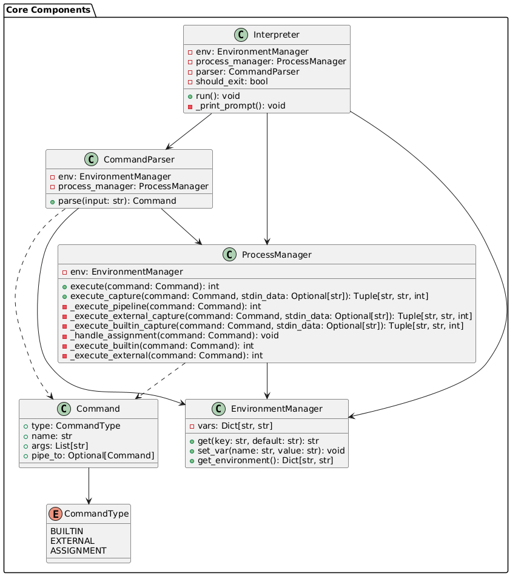
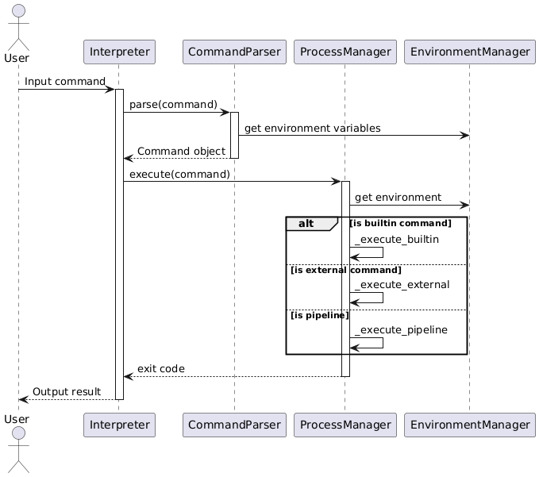

# Документация по архитектуре

## Обзор компонентов

Приложение следует модульной архитектуре со следующими основными компонентами:

### Основные компоненты

## Поток данных

## Обязанности компонентов

### Интерпретатор (Interpreter)
- Управляет жизненным циклом приложения
- Координирует взаимодействие компонентов
- Обрабатывает сигналы выхода
- Предоставляет командную строку

### Парсер команд (CommandParser)
- Обрабатывает входные строки с учетом:
  - Одинарных и двойных кавычек
  - Экранирования символов
  - Подстановки переменных
- Определяет пайплайны и отдельные команды
- Создает объекты команд

### Менеджер процессов (ProcessManager)
- Выполняет встроенные команды (cat, echo, wc, pwd, exit)
- Управляет выполнением внешних процессов
- Обрабатывает пайплайны и перенаправление ввода-вывода
- Обрабатывает присваивания команд

### Менеджер окружения (EnvironmentManager)
- Поддерживает переменные окружения
- Обрабатывает присваивания переменных
- Выполняет подстановку переменных
- Предоставляет окружение дочерним процессам

### Команда (Command)
Представляет команду со следующими характеристиками:
- Тип (BUILTIN, EXTERNAL или ASSIGNMENT)
- Имя и аргументы
- Соединение пайплайна (если есть)

## Детали реализации

### Обработка команд
1. Входная строка обрабатывается парсером команд
2. Переменные подставляются с помощью менеджера окружения
3. Создается объект команды соответствующего типа
4. Менеджер процессов выполняет команду:
   - Встроенные команды выполняются напрямую
   - Внешние команды запускаются как процессы
   - Пайплайны обрабатываются через цепочки процессов

### Управление окружением
- Переменные хранятся в словаре
- Системные переменные окружения наследуются
- Подстановка переменных поддерживает синтаксис `$VAR` и `${VAR}`
- Окружение передается дочерним процессам

### Обработка пайплайнов
- Команды в пайплайне выполняются последовательно
- Вывод каждой команды передается следующей
- Обработка ошибок и коды выхода распространяются по цепочке
