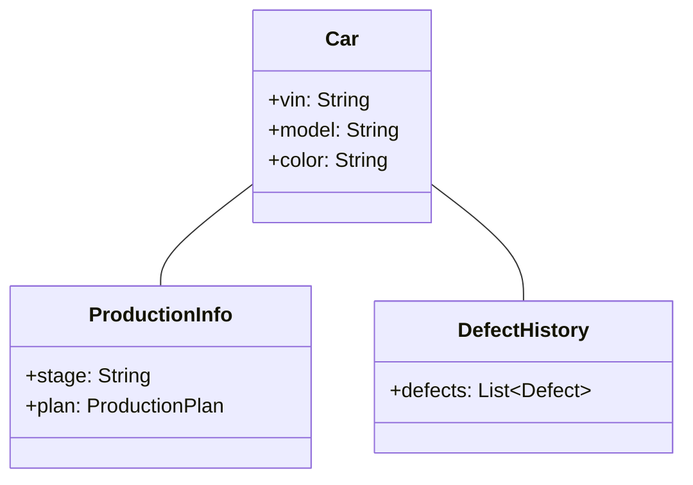

# Анализ недостатков диаграммы классов и рекомендации по исправлению

## 1. Нарушение принципа единственной ответственности (SRP)
### Проблема:
- **Класс `Car`** содержит:
  - Производственные данные (`productionStage`, `productionPlan`)
  - Историю дефектов (`defectList`)
  - Историю ремонта (`repairHistory`)
  
### Решение:


## 2. Избыточные атрибуты и дублирование данных
Проблема:
Класс RepairZone:

numberOfPlaces и freePlaces дублируют данные из repairPlaces: List<RepairPlace>

Класс Order:

color дублирует информацию из Car

Решение:
```mermaid
Copy
classDiagram
    class RepairZone {
        +places: List~RepairPlace~
        +getAvailablePlaces() int
    }
    
    class Order {
        +model: CarModel
    }
    
    class CarModel {
        +availableColors: List~String~
    }
```
## 3. Сложные двунаправленные связи
Проблема:
Циклические зависимости между RepairTeam ↔ Worker ↔ Repair

Решение:
Ввести промежуточный класс для управления назначениями:

```mermaid
Copy
classDiagram
    class Assignment {
        +worker: Worker
        +repair: Repair
        +startTime: DateTime
    }
    
    Repair "1" -- "*" Assignment
    Worker "1" -- "*" Assignment
```
## 4. Недостаток бизнес-логики
Проблема:
Отсутствие явной модели для этапов производства:

Сборка кузова

Покраска

Контроль качества

Решение:
```mermaid
Copy
classDiagram
    class ProductionStage {
        +stageId: String
        +requiredChecks: List~QualityCheck~
    }
    
    class QualityCheck {
        +checkType: String
        +status: CheckStatus
    }
```
## 5. Проблемы с отчетами
Проблема:
Дублирование полей в QualityControlReport, ShiftReport, AccountingReport

Решение:
Создать базовый класс для отчетов:

```mermaid
Copy
classDiagram
    class Report {
        <<abstract>>
        +id: String
        +generationDate: DateTime
        +generate(): PDF
    }
    
    Report <|-- QualityReport
    Report <|-- ShiftReport
    Report <|-- AccountingReport
```
## 6. Отсутствие управления статусами
Проблема:
Нет механизма отслеживания статусов ремонта и производства

Решение:
```mermaid
Copy
classDiagram
    class RepairStatus {
        +status: String
        +timestamp: DateTime
    }
    
    Repair "1" -- "*" RepairStatus
```
## 7. Недостатки в управлении ресурсами
Проблема:
Нет связи между доступностью рабочих и ремонтных мест

Решение:
```mermaid
Copy
classDiagram
    class ResourceManager {
        +getAvailableWorkers(): List~Worker~
        +getFreePlaces(): List~RepairPlace~
        +assignRepair(worker: Worker, place: RepairPlace)
    }
```
Ключевые рекомендации:
Разделить монолитные классы на специализированные компоненты

Ввести статусные модели для отслеживания жизненного цикла объектов

Реализовать фабрики для сложных объектов (например, отчетов)

Добавить сервисные классы для управления ресурсами и логикой назначений

Использовать паттерн Observer для автоматического обновления данных о доступности рабочих и мест

Пример исправленной связи для отчетов:

```mermaid
Copy
classDiagram
    class ReportGenerator {
        +generateQualityReport(): QualityReport
        +generateShiftReport(team: RepairTeam): ShiftReport
        +generateAccountingReport(month: int): AccountingReport
    }
    
    ReportGenerator --> QualityReport
    ReportGenerator --> ShiftReport
    ReportGenerator --> AccountingReport
```
